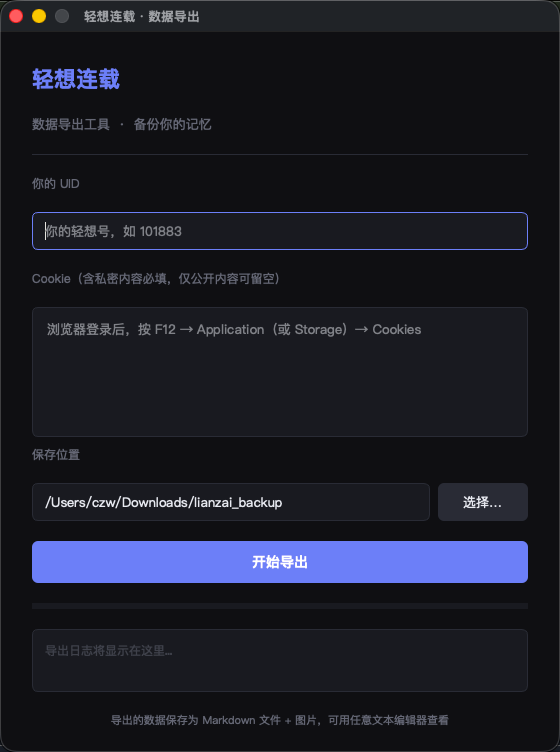

# 轻想连载 · 数据导出工具

十年了。

那时候每天更新连载，等别人评论，回别人的故事。如今很少再打开这个 app，用的人也越来越少了。但那些文字还在，那些评论还在，那个每天坚持写作的自己也还在。

太多回忆需要被好好保留。

于是写了这个工具——把你在轻想连载里写下的一切，完整地备份到本地。文字、图片、评论，一条也不落。

希望大家都能记住十年前的自己。

---

## 功能

- 导出所有连载（含私密）
- 保存每篇内容的文字与图片
- 保留读者评论与回复
- 生成 Markdown 文件，任意文本编辑器可读
- 同时保存原始 JSON 数据

## 下载

前往 [Releases](https://github.com/thatgameapple/lianzai-export/releases) 下载对应系统的版本：

- **macOS**：下载 `.dmg` 文件
- **Windows**：下载 `.zip` 文件，解压后运行

## 使用方法

1. 填入你的**轻想号**（个人主页 URL 末尾的数字）
2. 浏览器登录轻想连载后，按 `F12` → Application → Cookies，复制 `PLAY_SESSION` 和 `rememberme` 的值粘贴到 Cookie 栏（含私密内容必填）
3. 选择保存位置
4. 点击「开始导出」

导出完成后，每个连载会生成一个文件夹，包含 `content.md`（正文+评论）和 `images/`（图片）。

## 截图

## 致轻想

谢谢这十年。
